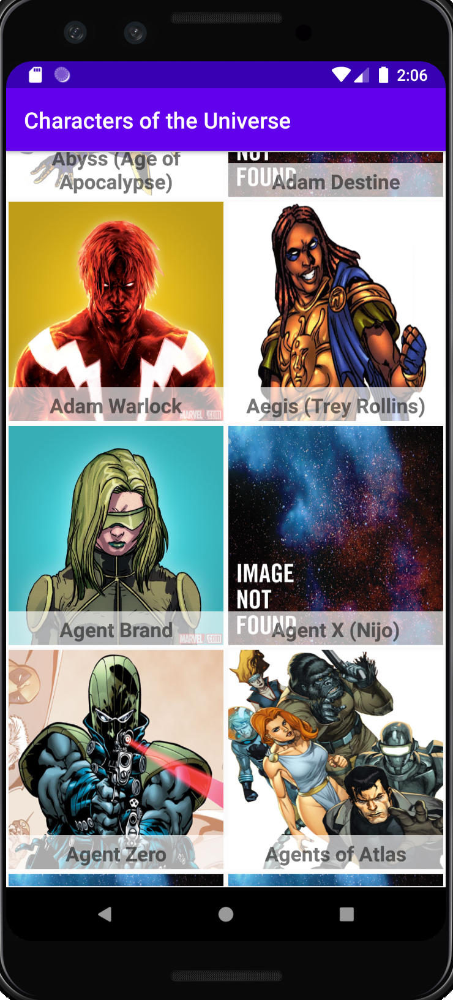

# Marvel Comics Universe - Comic Characters 
(To download the app, please check the apk attached on the right, as the final release build. To see in Android Studio, please clone and add your own public/private keys in Utils.kt class)
I created this app to practice all the latest trends and technologies that have been coming up in Android.  Specially these ones - 

 1. MVVM architecture best practices
 2. RXJava
 3. LiveData
 4. Android Jetpack -- ViewBinding, Navigation Component, DataBinding 
 5. Improved DataBinding with DiffUtil class, for all recyclerViews 
 6. Retrofit and OAuth/Key Authentication for API calls
 7. Dagger2
 8. Glide 
 
Here's a special highlight of other things I learnt while implementing this app and sources for future read - 

<b>Learned how to apply Kotlin extension functions.</b> This is being used on the ImageView library by android's widget package. I used an ext4ension function called loadImage and made it load the uri using Glide library. Also used Glide to auto-implement a progressBar while the image is extracted in the background.  

<b>Learnt the best design patterns to use with current Android improvements.</b> Some of the old architecture like MVC might be too heavy, compared to MVVM that helps us implement the Jetpack libraries better.

<b>Instead of using Intents to passs data/parcel around fragments, used Navigation Component's actions </b> 

<b>Using DiffUtil.Callbacks to improve recyclerView + Databinding experience and performance </b>

And here's some screenshots on how it looks (didn't focus too much on making it fancy, this is just too learn new architectural concepts)

  
   
    

